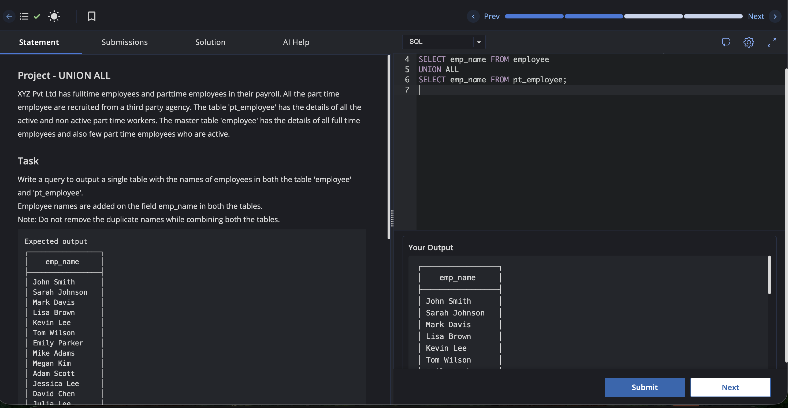

````markdown
# Experiment 2.2

**Name:** Pahulpreet Singh

**UID:** 24BCS10261

## Aim

To combine the employee names from two tables using the `UNION ALL` operator and display the final result without removing duplicate records.

## Question

XYZ Pvt Ltd has full-time employees and part-time employees in their payroll. All the part-time employees are recruited from a third-party agency. The table `pt_employee` has the details of all the active and non-active part-time workers. The master table `employee` has the details of all full-time employees and also a few part-time employees who are active.

### Task

Write a query to output a single table with the names of employees in both the tables `employee` and `pt_employee`.

Employee names are stored in the field `emp_name` in both the tables.

**Note:** Do not remove the duplicate names while combining both the tables.

### Expected Output

```text
┌─────────────────┐
│    emp_name     │
├─────────────────┤
│ John Smith      │
│ Sarah Johnson   │
│ Mark Davis      │
│ Lisa Brown      │
│ Kevin Lee       │
│ Tom Wilson      │
│ Emily Parker    │
│ Mike Adams      │
│ Megan Kim       │
│ Adam Scott      │
│ Jessica Lee     │
│ David Chen      │
│ Julia Lee       │
│ Daniel Brown    │
│ Olivia Taylor   │
│ Maxwell Johnson │
│ Ashley Kim      │
│ Jackie Nguyen   │
│ Derek Smith     │
│ Emily Wang      │
│ Nate Thomas     │
│ Sophia Lee      │
│ Tom Wilson      │
│ Emily Parker    │
│ Mike Adams      │
│ Megan Kim       │
└─────────────────┘
```

## SQL Queries Used

```sql
/* Write a query to output a single table with the names of employees in both
the table 'employee' and 'pt_employee'.
Employee names are added on the field emp_name in both the tables.
Note: Do not remove the duplicate names while combining both the tables. */

SELECT emp_name
FROM employee

UNION ALL

SELECT emp_name
FROM pt_employee;
```

## Output

```text
┌─────────────────┐
│    emp_name     │
├─────────────────┤
│ John Smith      │
│ Sarah Johnson   │
│ Mark Davis      │
│ Lisa Brown      │
│ Kevin Lee       │
│ Tom Wilson      │
│ Emily Parker    │
│ Mike Adams      │
│ Megan Kim       │
│ Adam Scott      │
│ Jessica Lee     │
│ David Chen      │
│ Julia Lee       │
│ Daniel Brown    │
│ Olivia Taylor   │
│ Maxwell Johnson │
│ Ashley Kim      │
│ Jackie Nguyen   │
│ Derek Smith     │
│ Emily Wang      │
│ Nate Thomas     │
│ Sophia Lee      │
│ Tom Wilson      │
│ Emily Parker    │
│ Mike Adams      │
│ Megan Kim       │
└─────────────────┘

Hooray, you did it!
```

## Output Screenshot



## Image Explanation

The screenshot shows the SQL query using the `UNION ALL` operator to combine the employee names from the `employee` and `pt_employee` tables. Since `UNION ALL` does not remove duplicate records, repeated employee names appear in the final output. The successful execution confirms that all records from both tables have been displayed.

## Result

The employee names from the `employee` and `pt_employee` tables were successfully combined using the `UNION ALL` operator. The output includes all records from both tables, including duplicate names.
````

