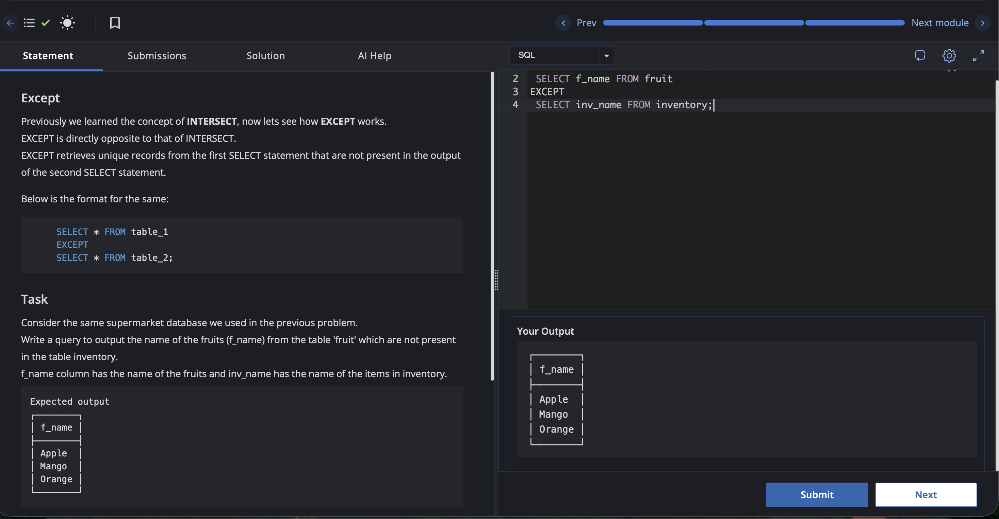

# Experiment 2.4

Name: Pahulpreet Singh

UID: 24BCS10261

## Aim

To retrieve the fruit names that are present in the `fruit` table but not in the `inventory` table using the `EXCEPT` operator.

## Question

Previously we learned the concept of `INTERSECT`, now let's see how `EXCEPT` works.

`EXCEPT` is directly opposite to that of `INTERSECT`.

`EXCEPT` retrieves unique records from the first `SELECT` statement that are not present in the output of the second `SELECT` statement.

Below is the format for the same:

```sql
SELECT * FROM table_1
EXCEPT
SELECT * FROM table_2;
```

### Task

Consider the same supermarket database we used in the previous problem.

Write a query to output the name of the fruits (`f_name`) from the table `fruit` which are not present in the table `inventory`.

`f_name` column has the name of the fruits and `inv_name` has the name of the items in `inventory`.

## SQL Queries Used

### Find Fruits Not Present in Inventory

```sql
SELECT f_name
FROM fruit
EXCEPT
SELECT inv_name
FROM inventory;
```

## Output

```text
┌────────┐
│ f_name │
├────────┤
│ Apple  │
│ Mango  │
│ Orange │
└────────┘

Excellent work!
```

## Output Screenshot



## Image Explanation

The screenshot shows the SQL editor with the `EXCEPT` query executed on the `fruit` and `inventory` tables. The output panel displays the fruit names that are present in the `fruit` table but not in the `inventory` table, confirming that the query executed successfully.

## Result

The fruit names that are not present in the `inventory` table were retrieved successfully using the `EXCEPT` operator.
