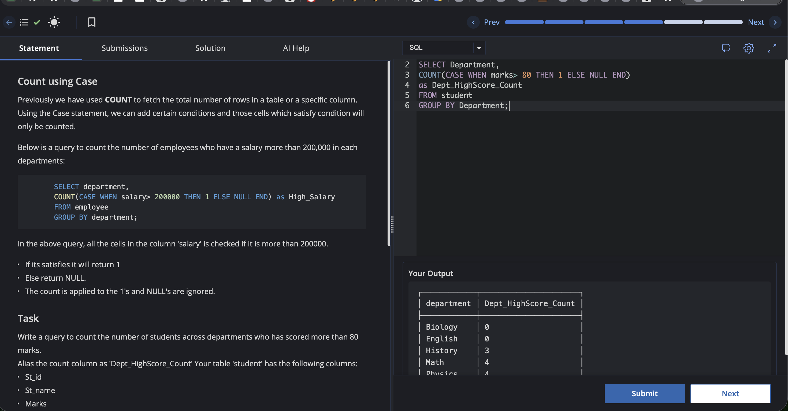

# Experiment 3.1

Name: Pahulpreet Singh

UID: 24BCS10261

## Aim

To count the number of students in each department who have scored more than 80 marks using the `CASE` statement with the `COUNT` aggregate function.

## Question

Previously we have used `COUNT` to fetch the total number of rows in a table or a specific column.

Using the `CASE` statement, we can add certain conditions and those cells which satisfy the condition will only be counted.

Below is a query to count the number of employees who have a salary more than `200000` in each department:

```sql
SELECT department,
COUNT(CASE WHEN salary > 200000 THEN 1 ELSE NULL END) AS High_Salary
FROM employee
GROUP BY department;
```

In the above query, all the cells in the column `salary` are checked if they are more than `200000`.

- If it satisfies the condition, it will return `1`.
- Else, it will return `NULL`.
- The `COUNT` function is applied to the `1`s and `NULL` values are ignored.

### Task

Write a query to count the number of students across departments who have scored more than **80** marks.

Alias the count column as **`Dept_HighScore_Count`**.

Your table `student` has the following columns:

- `St_id`
- `St_name`
- `Marks`
- `Department`

## SQL Queries Used

### Count Students Scoring More Than 80 Marks

```sql
SELECT Department,
COUNT(CASE WHEN marks > 80 THEN 1 ELSE NULL END)
AS Dept_HighScore_Count
FROM student
GROUP BY Department;
```

## Output

```text
┌────────────┬──────────────────────┐
│ department │ Dept_HighScore_Count │
├────────────┼──────────────────────┤
│ Biology    │ 0                    │
│ English    │ 0                    │
│ History    │ 3                    │
│ Math       │ 4                    │
│ Physics    │ 4                    │
└────────────┴──────────────────────┘

Great job, keep it up!
```

## Output Screenshot



## Image Explanation

The screenshot shows the SQL editor with the `COUNT` and `CASE` query executed on the `student` table. The output panel displays the number of students in each department who scored more than 80 marks, confirming that the conditional aggregation query executed successfully.

## Result

The number of students scoring more than 80 marks in each department was counted successfully using the `CASE` statement with the `COUNT` aggregate function.
