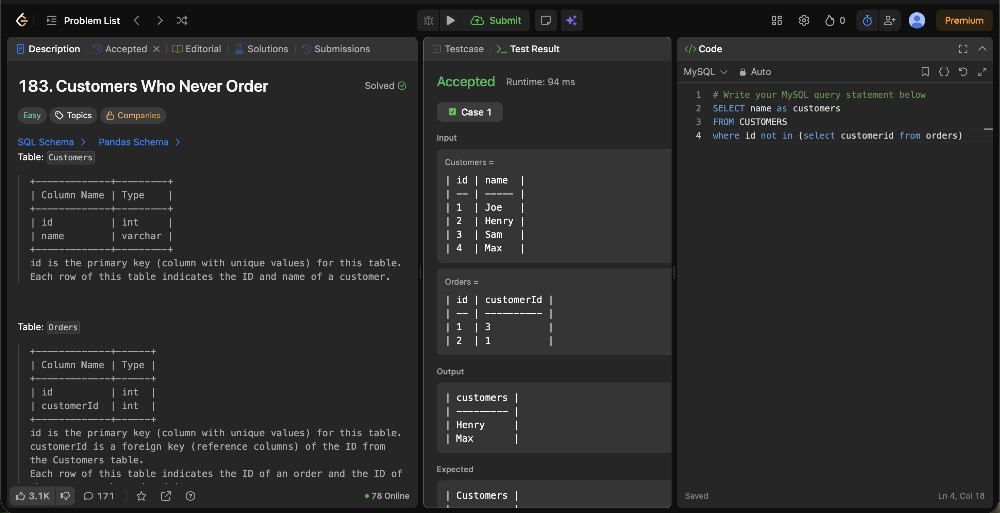

# Experiment 3.3

Name: Pahulpreet Singh

UID: 24BCS10261

## Aim

To retrieve the names of customers who have never placed an order using a subquery with the `NOT IN` operator.

## Question

You are given two tables: `Customers` and `Orders`.

The `Customers` table contains the details of all customers, while the `Orders` table contains the details of orders placed by customers.

Write a query to find all customers who never ordered anything.

Return the result table in any order.

### Customers Table

| Column Name | Type |
|-------------|------|
| id | int |
| name | varchar |

- `id` is the primary key (column with unique values) for this table.
- Each row of this table indicates the ID and name of a customer.

### Orders Table

| Column Name | Type |
|-------------|------|
| id | int |
| customerId | int |

- `id` is the primary key (column with unique values) for this table.
- `customerId` is a foreign key (reference column) of the `id` from the `Customers` table.
- Each row of this table indicates the ID of an order and the ID of the customer who ordered it.

## SQL Queries Used

### Find Customers Who Never Ordered

```sql
SELECT name AS Customers
FROM Customers
WHERE id NOT IN (
    SELECT customerId
    FROM Orders
);
```

## Output

```text
+-----------+
| Customers |
+-----------+
| Henry     |
| Max       |
+-----------+

Accepted
```

## Output Screenshot



## Image Explanation

The screenshot shows the SQL query executed on the `Customers` and `Orders` tables. The output displays the names of customers who have never placed an order by comparing customer IDs using the `NOT IN` operator. The query executed successfully and returned the expected result.

## Result

The names of customers who never placed an order were retrieved successfully using the `NOT IN` operator.
