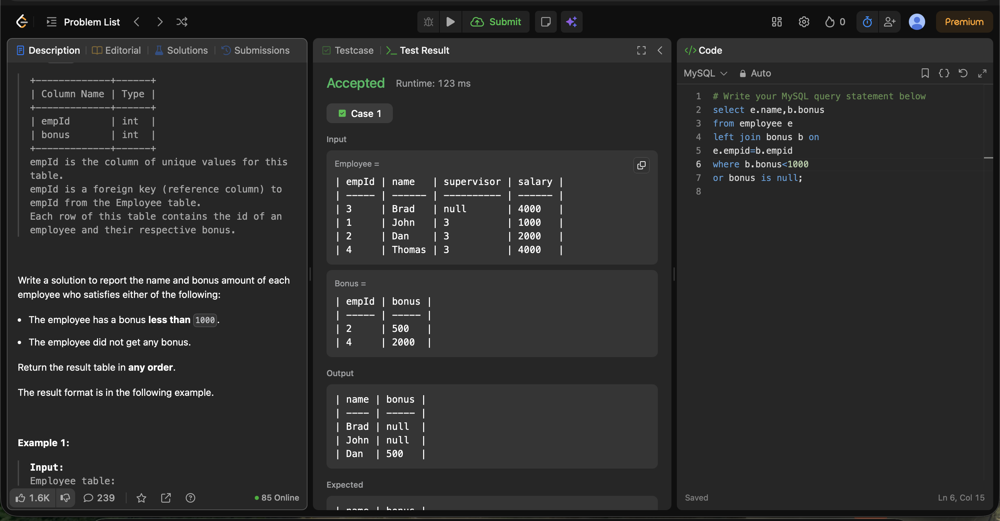

# Experiment 3.4

Name: Pahulpreet Singh

UID: 24BCS10261

## Aim

To retrieve the names and bonus amounts of employees whose bonus is less than 1000 or who did not receive any bonus using the `LEFT JOIN` operation.

## Question

You are given two tables: `Employee` and `Bonus`.

The `Employee` table contains the details of employees, including their employee ID, name, supervisor ID, and salary.

The `Bonus` table contains the employee ID and the bonus amount received by the employee.

Write a solution to report the name and bonus amount of each employee who satisfies either of the following:

- The employee has a bonus less than **1000**.
- The employee did not get any bonus.

Return the result table in any order.

### Employee Table

| Column Name | Type |
|-------------|------|
| empId | int |
| name | varchar |
| supervisor | int |
| salary | int |

- `empId` is the column with unique values for this table.
- Each row of this table indicates the name and the ID of an employee in addition to their salary and the ID of their manager.

### Bonus Table

| Column Name | Type |
|-------------|------|
| empId | int |
| bonus | int |

- `empId` is the column of unique values for this table.
- `empId` is a foreign key (reference column) to `empId` from the `Employee` table.
- Each row of this table contains the ID of an employee and their respective bonus.

## SQL Queries Used

### Find Employees with Bonus Less Than 1000 or No Bonus

```sql
SELECT e.name, b.bonus
FROM Employee e
LEFT JOIN Bonus b
ON e.empId = b.empId
WHERE b.bonus < 1000
   OR b.bonus IS NULL;
```

## Output

```text
+------+-------+
| name | bonus |
+------+-------+
| Brad | null  |
| John | null  |
| Dan  | 500   |
+------+-------+

Accepted
```

## Output Screenshot



## Image Explanation

The screenshot shows the SQL query executed using a `LEFT JOIN` between the `Employee` and `Bonus` tables. The output displays the employees whose bonus is less than 1000 or who did not receive any bonus, confirming that the query executed successfully.

## Result

The names and bonus amounts of employees with a bonus less than 1000 or no bonus were retrieved successfully using the `LEFT JOIN` operation.
