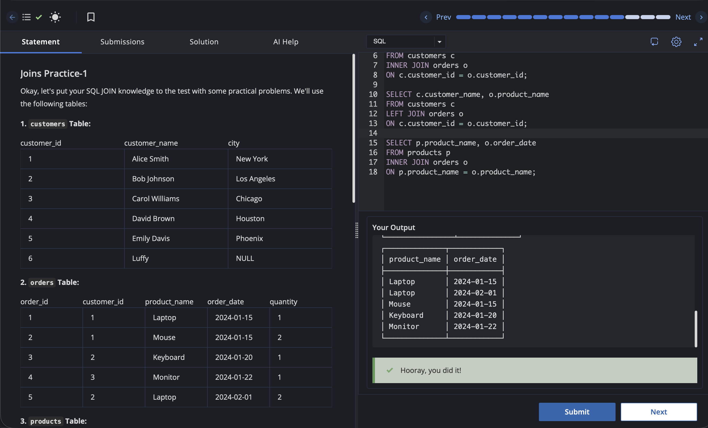

# Experiment 4.1

Name: Pahulpreet Singh

UID: 24BCS10261

## Aim

To practice SQL JOIN operations by retrieving related data from multiple tables using `INNER JOIN` and `LEFT JOIN`.

## Question

### Joins Practice-1

Okay, let's put your SQL JOIN knowledge to the test with some practical problems. We'll use the following tables:

### 1. `customers` Table

| customer_id | customer_name | city        |
| ----------- | ------------- | ----------- |
| 1           | Alice Smith   | New York    |
| 2           | Bob Johnson   | Los Angeles |
| 3           | Carol Williams| Chicago     |
| 4           | David Brown   | Houston     |
| 5           | Emily Davis   | Phoenix     |
| 6           | Luffy         | NULL        |

### 2. `orders` Table

| order_id | customer_id | product_name | order_date | quantity |
| -------- | ----------- | ------------ | ---------- | -------- |
| 1        | 1           | Laptop       | 2024-01-15 | 1        |
| 2        | 1           | Mouse        | 2024-01-15 | 2        |
| 3        | 2           | Keyboard     | 2024-01-20 | 1        |
| 4        | 3           | Monitor      | 2024-01-22 | 1        |
| 5        | 2           | Laptop       | 2024-02-01 | 2        |

### 3. `products` Table

| product_id | product_name | category_id | price |
| ---------- | ------------ | ----------- | ----- |
| 1          | Laptop       | 1           | 1200  |
| 2          | Mouse        | 2           | 25    |
| 3          | Keyboard     | 2           | 75    |
| 4          | Monitor      | 1           | 300   |
| 5          | Webcam       | 2           | 60    |
| 6          | Tablet       | 3           | 250   |

### 4. `categories` Table

| category_id | category_name |
| ----------- | ------------- |
| 1           | Electronics   |
| 2           | Accessories   |
| 3           | Tablets       |

### 5. `employees` Table

| employee_id | employee_name | manager_id | department |
| ----------- | ------------- | ---------- | ---------- |
| 1           | John Doe      | NULL       | Sales      |
| 2           | Jane Smith    | 1          | Sales      |
| 3           | Peter Jones   | 1          | Marketing  |
| 4           | Mary Green    | 3          | Marketing  |
| 5           | Raj           | 2          | Sales      |

### Problems

**1. Customers and Orders:** List the `customer_name` and `order_date` for all customers who have placed orders.

**2. All Customers and Their Orders:** List all customer names and their corresponding `product_name` from orders, if they have any. Include customers even if they haven't placed any orders.

**3. Find Products and Their Orders:** Display Product Name and the `order_date` from all the products that are ordered.

## SQL Queries Used

### 1. Customers and Orders

```sql
SELECT c.customer_name, o.order_date
FROM customers c
INNER JOIN orders o
ON c.customer_id = o.customer_id;
```

### 2. All Customers and Their Orders

```sql
SELECT c.customer_name, o.product_name
FROM customers c
LEFT JOIN orders o
ON c.customer_id = o.customer_id;
```

### 3. Find Products and Their Orders

```sql
SELECT p.product_name, o.order_date
FROM products p
INNER JOIN orders o
ON p.product_name = o.product_name;
```

## Output

### 1. Customers and Orders

```text
+----------------+------------+
| customer_name  | order_date |
+----------------+------------+
| Alice Smith    | 2024-01-15 |
| Alice Smith    | 2024-01-15 |
| Bob Johnson    | 2024-01-20 |
| Carol Williams | 2024-01-22 |
| Bob Johnson    | 2024-02-01 |
+----------------+------------+
```

### 2. All Customers and Their Orders

```text
+----------------+--------------+
| customer_name  | product_name |
+----------------+--------------+
| Alice Smith    | Laptop       |
| Alice Smith    | Mouse        |
| Bob Johnson    | Keyboard     |
| Carol Williams | Monitor      |
| Bob Johnson    | Laptop       |
| David Brown    | NULL         |
| Emily Davis    | NULL         |
| Luffy          | NULL         |
+----------------+--------------+
```

### 3. Find Products and Their Orders

```text
+--------------+------------+
| product_name | order_date |
+--------------+------------+
| Laptop       | 2024-01-15 |
| Mouse        | 2024-01-15 |
| Keyboard     | 2024-01-20 |
| Monitor      | 2024-01-22 |
| Laptop       | 2024-02-01 |
+--------------+------------+
```

## Output Screenshot



## Image Explanation

The screenshot shows the SQL queries executed using `INNER JOIN` and `LEFT JOIN` on the `customers`, `orders`, and `products` tables. The output displays customers with their orders, all customers including those without orders, and the products that have been ordered.

## Result

The required data was successfully retrieved from the multiple tables using `INNER JOIN` and `LEFT JOIN` operations.
