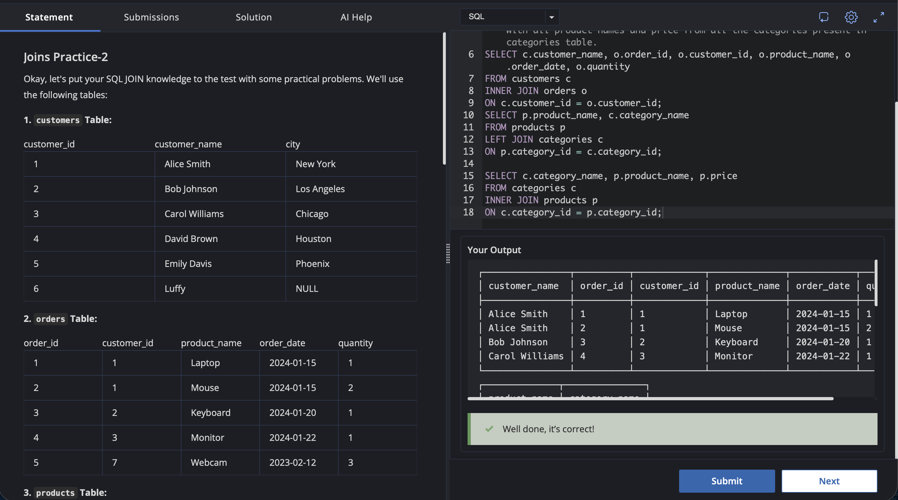

# Experiment 4.3

Name: Pahulpreet Singh

UID: 24BCS10261

## Aim

To practice SQL JOIN operations by retrieving related information from the `customers`, `orders`, `products`, and `categories` tables using different types of joins.

## Question

### Joins Practice-2

Okay, let's put your SQL JOIN knowledge to the test with some practical problems. We'll use the following tables:

### 1. `customers` Table

| customer_id | customer_name | city |
| ----------- | ------------- | ---- |
| 1 | Alice Smith | New York |
| 2 | Bob Johnson | Los Angeles |
| 3 | Carol Williams | Chicago |
| 4 | David Brown | Houston |
| 5 | Emily Davis | Phoenix |
| 6 | Luffy | NULL |

### 2. `orders` Table

| order_id | customer_id | product_name | order_date | quantity |
| -------- | ----------- | ------------ | ---------- | -------- |
| 1 | 1 | Laptop | 2024-01-15 | 1 |
| 2 | 1 | Mouse | 2024-01-15 | 2 |
| 3 | 2 | Keyboard | 2024-01-20 | 1 |
| 4 | 3 | Monitor | 2024-01-22 | 1 |
| 5 | 7 | Webcam | 2023-02-12 | 3 |

### 3. `products` Table

| product_id | product_name | category_id | price |
| ---------- | ------------ | ----------- | ----- |
| 1 | Laptop | 1 | 1200 |
| 2 | Mouse | 2 | 25 |
| 3 | Keyboard | 2 | 75 |
| 4 | Monitor | 1 | 300 |
| 5 | Webcam | 2 | 60 |
| 6 | Tablet | 3 | 250 |

### 4. `categories` Table

| category_id | category_name |
| ----------- | ------------- |
| 1 | Electronics |
| 2 | Accessories |
| 3 | Tablets |

### 5. `employees` Table

| employee_id | employee_name | manager_id | department |
| ----------- | ------------- | ---------- | ---------- |
| 1 | John Doe | NULL | Sales |
| 2 | Jane Smith | 1 | Sales |
| 3 | Peter Jones | 1 | Marketing |
| 4 | Mary Green | 3 | Marketing |
| 5 | Raj | 2 | Sales |

### Problems

**1. All orders with Customers Details:** Get all of the orders table and also the details of respective customers if they exist. Use the customer and orders table.

**2. Products and Categories:** Create a combined list of all products and all categories. Include all product names and all category names. Where there's a match, show both; otherwise, use NULLs.

**3. All category names with product details:** Display `category_name`, along with all product names and price from all the categories present in the categories table.

## Expected Output

### 1. All Orders with Customers Details

```text
┌────────────────┬──────────┬─────────────┬──────────────┬────────────┬──────────┐
│ customer_name  │ order_id │ customer_id │ product_name │ order_date │ quantity │
├────────────────┼──────────┼─────────────┼──────────────┼────────────┼──────────┤
│ Alice Smith    │ 1        │ 1           │ Laptop       │ 2024-01-15 │ 1        │
│ Alice Smith    │ 2        │ 1           │ Mouse        │ 2024-01-15 │ 2        │
│ Bob Johnson    │ 3        │ 2           │ Keyboard     │ 2024-01-20 │ 1        │
│ Carol Williams │ 4        │ 3           │ Monitor      │ 2024-01-22 │ 1        │
└────────────────┴──────────┴─────────────┴──────────────┴────────────┴──────────┘
```

### 2. Products and Categories

```text
┌──────────────┬───────────────┐
│ product_name │ category_name │
├──────────────┼───────────────┤
│ Laptop       │ Electronics   │
│ Mouse        │ Accessories   │
│ Keyboard     │ Accessories   │
│ Monitor      │ Electronics   │
│ Webcam       │ Accessories   │
│ Tablet       │ Tablets       │
└──────────────┴───────────────┘
```

### 3. All Category Names with Product Details

```text
┌───────────────┬──────────────┬───────┐
│ category_name │ product_name │ price │
├───────────────┼──────────────┼───────┤
│ Electronics   │ Laptop       │ 1200  │
│ Accessories   │ Mouse        │ 25    │
│ Accessories   │ Keyboard     │ 75    │
│ Electronics   │ Monitor      │ 300   │
│ Accessories   │ Webcam       │ 60    │
│ Tablets       │ Tablet       │ 250   │
└───────────────┴──────────────┴───────┘
```

## SQL Queries Used

### 1. All Orders with Customers Details

```sql
SELECT c.customer_name, o.order_id, o.customer_id, o.product_name, o.order_date, o.quantity
FROM customers c
INNER JOIN orders o
ON c.customer_id = o.customer_id;
```

### 2. Products and Categories

```sql
SELECT p.product_name, c.category_name
FROM products p
LEFT JOIN categories c
ON p.category_id = c.category_id;
```

### 3. All Category Names with Product Details

```sql
SELECT c.category_name, p.product_name, p.price
FROM categories c
INNER JOIN products p
ON c.category_id = p.category_id;
```

## Output

### 1. All Orders with Customers Details

```text
+----------------+----------+-------------+--------------+------------+----------+
| customer_name  | order_id | customer_id | product_name | order_date | quantity |
+----------------+----------+-------------+--------------+------------+----------+
| Alice Smith    | 1        | 1           | Laptop       | 2024-01-15 | 1        |
| Alice Smith    | 2        | 1           | Mouse        | 2024-01-15 | 2        |
| Bob Johnson    | 3        | 2           | Keyboard     | 2024-01-20 | 1        |
| Carol Williams | 4        | 3           | Monitor      | 2024-01-22 | 1        |
+----------------+----------+-------------+--------------+------------+----------+
```

### 2. Products and Categories

```text
+--------------+---------------+
| product_name | category_name |
+--------------+---------------+
| Laptop       | Electronics   |
| Mouse        | Accessories   |
| Keyboard     | Accessories   |
| Monitor      | Electronics   |
| Webcam       | Accessories   |
| Tablet       | Tablets       |
+--------------+---------------+
```

### 3. All Category Names with Product Details

```text
+---------------+--------------+-------+
| category_name | product_name | price |
+---------------+--------------+-------+
| Electronics   | Laptop       | 1200  |
| Accessories   | Mouse        | 25    |
| Accessories   | Keyboard     | 75    |
| Electronics   | Monitor      | 300   |
| Accessories   | Webcam       | 60    |
| Tablets       | Tablet       | 250   |
+---------------+--------------+-------+
```

## Output Screenshot



## Image Explanation

The screenshot shows the SQL queries executed using JOIN operations on the `customers`, `orders`, `products`, and `categories` tables.

The first query retrieves orders that have a matching customer. The second query combines product names with their corresponding category names. The third query displays each category along with its associated product name and price.

## Result

The required information was successfully retrieved from the `customers`, `orders`, `products`, and `categories` tables using appropriate SQL JOIN operations. The queries successfully displayed customer details with orders, product details with categories, and category names with their corresponding products and prices.
