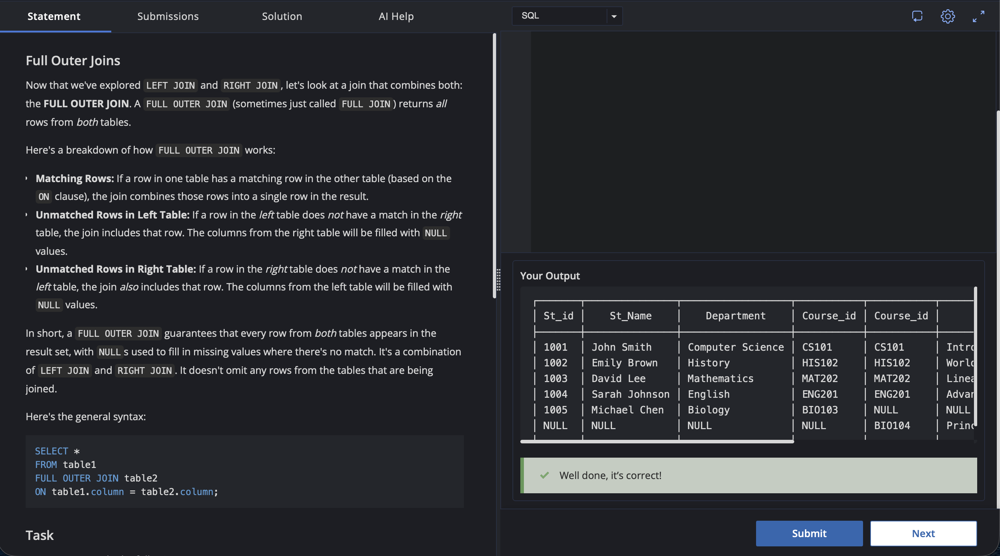

# Experiment 4.4

Name: Pahulpreet Singh

UID: 24BCS10261

## Aim

To perform a `FULL OUTER JOIN` operation on the `student` and `course` tables using the `Course_id` column and retrieve all matching and non-matching records from both tables.

## Question

### Full Outer Joins

Now that we've explored `LEFT JOIN` and `RIGHT JOIN`, let's look at a join that combines both: the **FULL OUTER JOIN**.

A `FULL OUTER JOIN` (sometimes just called `FULL JOIN`) returns *all* rows from *both* tables.

Here's a breakdown of how `FULL OUTER JOIN` works:

* **Matching Rows:** If a row in one table has a matching row in the other table (based on the `ON` clause), the join combines those rows into a single row in the result.
* **Unmatched Rows in Left Table:** If a row in the left table does not have a match in the right table, the join includes that row. The columns from the right table will be filled with `NULL` values.
* **Unmatched Rows in Right Table:** If a row in the right table does not have a match in the left table, the join also includes that row. The columns from the left table will be filled with `NULL` values.

In short, a `FULL OUTER JOIN` guarantees that every row from *both* tables appears in the result set, with `NULL` values used to fill in missing values where there's no match. It's a combination of `LEFT JOIN` and `RIGHT JOIN`. It doesn't omit any rows from the tables that are being joined.

### General Syntax

```sql
SELECT *
FROM table1
FULL OUTER JOIN table2
ON table1.column = table2.column;
```

### Task

Write a query to do the following:

* FULL OUTER JOIN the `student` and `course` tables using `Course_id` to match the tables.
* Output the joined table.

## Expected Output

| St_id | St_Name       | Department       | Course_id | Course_id | Course_Name                      | Credits | Prof_id |
| ----- | ------------- | ---------------- | --------- | --------- | -------------------------------- | ------- | ------- |
| 1001  | John Smith    | Computer Science | CS101     | CS101     | Introduction to Computer Science | 3       | 2001    |
| 1002  | Emily Brown   | History          | HIS102    | HIS102    | World History II                 | 3       | 2004    |
| 1003  | David Lee     | Mathematics      | MAT202    | MAT202    | Linear Algebra                   | 2       | 2002    |
| 1004  | Sarah Johnson | English          | ENG201    | ENG201    | Advanced Writing                 | 4       | 2003    |
| 1005  | Michael Chen  | Biology          | BIO103    | NULL      | NULL                             | NULL    | NULL    |
| NULL  | NULL          | NULL             | NULL      | BIO104    | Principles of Bio-technology     | 4       | 2006    |

## SQL Queries Used

### FULL OUTER JOIN Student and Course

```sql
SELECT *
FROM student
FULL OUTER JOIN course
ON student.Course_id = course.Course_id;
```

## Output

```text
+-------+---------------+------------------+----------+----------+----------------------------------+---------+---------+
| St_id | St_Name       | Department       | Course_id | Course_id | Course_Name                      | Credits | Prof_id |
+-------+---------------+------------------+----------+----------+----------------------------------+---------+---------+
| 1001  | John Smith    | Computer Science | CS101    | CS101    | Introduction to Computer Science | 3       | 2001    |
| 1002  | Emily Brown   | History          | HIS102   | HIS102   | World History II                 | 3       | 2004    |
| 1003  | David Lee     | Mathematics      | MAT202   | MAT202   | Linear Algebra                   | 2       | 2002    |
| 1004  | Sarah Johnson | English          | ENG201   | ENG201   | Advanced Writing                 | 4       | 2003    |
| 1005  | Michael Chen  | Biology          | BIO103   | NULL     | NULL                             | NULL    | NULL    |
| NULL  | NULL          | NULL             | NULL     | BIO104   | Principles of Bio-technology     | 4       | 2006    |
+-------+---------------+------------------+----------+----------+----------------------------------+---------+---------+
```

## Output Screenshot



## Image Explanation

The screenshot shows the SQL query executed using a `FULL OUTER JOIN` between the `student` and `course` tables using the `Course_id` column.

The output contains all matching records from both tables. It also retains `Michael Chen` from the `student` table even though his `Course_id` (`BIO103`) has no matching course. Similarly, the `BIO104` course from the `course` table is retained even though there is no corresponding student. The unmatched columns are displayed as `NULL`.

## Result

The `student` and `course` tables were successfully joined using the `FULL OUTER JOIN` operation. The result includes all matching and non-matching records from both tables, with `NULL` values displayed wherever a corresponding record does not exist.

