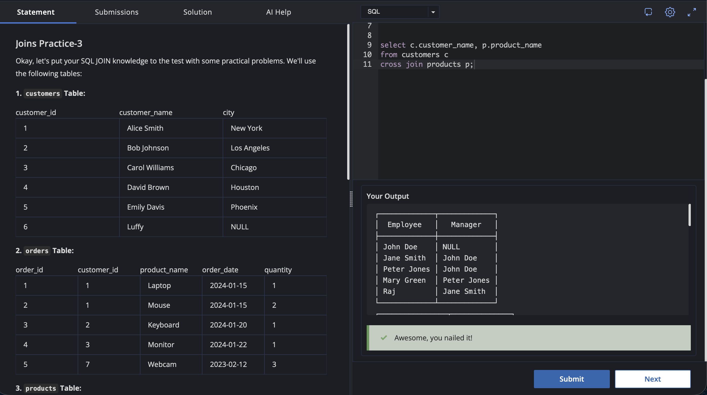

# Experiment 4.5

Name: Pahulpreet Singh

UID: 24BCS10261

## Aim

To practice SQL JOIN operations using a `SELF JOIN` to retrieve employee and manager names and a `CROSS JOIN` to generate every possible combination of customers and products.

## Question

### Joins Practice-3

Okay, let's put your SQL JOIN knowledge to the test with some practical problems. We'll use the following tables:

### 1. `customers` Table

| customer_id | customer_name  | city        |
| ----------- | -------------- | ----------- |
| 1           | Alice Smith    | New York    |
| 2           | Bob Johnson    | Los Angeles |
| 3           | Carol Williams | Chicago     |
| 4           | David Brown    | Houston     |
| 5           | Emily Davis    | Phoenix     |
| 6           | Luffy          | NULL        |

### 2. `orders` Table

| order_id | customer_id | product_name | order_date | quantity |
| -------- | ----------- | ------------ | ---------- | -------- |
| 1        | 1           | Laptop       | 2024-01-15 | 1        |
| 2        | 1           | Mouse        | 2024-01-15 | 2        |
| 3        | 2           | Keyboard     | 2024-01-20 | 1        |
| 4        | 3           | Monitor      | 2024-01-22 | 1        |
| 5        | 7           | Webcam       | 2023-02-12 | 3        |

### 3. `products` Table

| product_id | product_name | category_id | price |
| ---------- | ------------ | ----------- | ----- |
| 1          | Laptop       | 1           | 1200  |
| 2          | Mouse        | 2           | 25    |
| 3          | Keyboard     | 2           | 75    |
| 4          | Monitor      | 1           | 300   |
| 5          | Webcam       | 2           | 60    |
| 6          | Tablet       | 3           | 250   |

### 4. `categories` Table

| category_id | category_name |
| ----------- | ------------- |
| 1           | Electronics   |
| 2           | Accessories   |
| 3           | Tablets       |

### 5. `employees` Table

| employee_id | employee_name | manager_id | department |
| ----------- | ------------- | ---------- | ---------- |
| 1           | John Doe      | NULL       | Sales      |
| 2           | Jane Smith    | 1          | Sales      |
| 3           | Peter Jones   | 1          | Marketing  |
| 4           | Mary Green    | 3          | Marketing  |
| 5           | Raj           | 2          | Sales      |

### Problems

**1. Employee and Manager Names:** Display a list of employee names along with their manager's names. Use the `employees` table provided above.

**2. Every Possible Combination:** Show every possible combination of `customer_name` from the `customers` table and `product_name` from the `products` table.

## SQL Queries Used

### 1. Employee and Manager Names

```sql
SELECT e.employee_name AS employee_name,
       m.employee_name AS manager_name
FROM employees e
LEFT JOIN employees m
ON e.manager_id = m.employee_id;
```

### 2. Every Possible Combination

```sql
SELECT c.customer_name,
       p.product_name
FROM customers c
CROSS JOIN products p;
```

## Output

### 1. Employee and Manager Names

```text
+---------------+---------------+
| employee_name | manager_name  |
+---------------+---------------+
| John Doe      | NULL          |
| Jane Smith    | John Doe      |
| Peter Jones   | John Doe      |
| Mary Green    | Peter Jones   |
| Raj           | Jane Smith    |
+---------------+---------------+
```

### 2. Every Possible Combination

```text
+----------------+--------------+
| customer_name  | product_name |
+----------------+--------------+
| Alice Smith    | Laptop       |
| Alice Smith    | Mouse        |
| Alice Smith    | Keyboard     |
| Alice Smith    | Monitor      |
| Alice Smith    | Webcam       |
| Alice Smith    | Tablet       |
| Bob Johnson    | Laptop       |
| Bob Johnson    | Mouse        |
| Bob Johnson    | Keyboard     |
| Bob Johnson    | Monitor      |
| Bob Johnson    | Webcam       |
| Bob Johnson    | Tablet       |
| Carol Williams | Laptop       |
| Carol Williams | Mouse        |
| Carol Williams | Keyboard     |
| Carol Williams | Monitor      |
| Carol Williams | Webcam       |
| Carol Williams | Tablet       |
| David Brown    | Laptop       |
| David Brown    | Mouse        |
| David Brown    | Keyboard     |
| David Brown    | Monitor      |
| David Brown    | Webcam       |
| David Brown    | Tablet       |
| Emily Davis    | Laptop       |
| Emily Davis    | Mouse        |
| Emily Davis    | Keyboard     |
| Emily Davis    | Monitor      |
| Emily Davis    | Webcam       |
| Emily Davis    | Tablet       |
| Luffy          | Laptop       |
| Luffy          | Mouse        |
| Luffy          | Keyboard     |
| Luffy          | Monitor      |
| Luffy          | Webcam       |
| Luffy          | Tablet       |
+----------------+--------------+
```

## Output Screenshot



## Image Explanation

The screenshot shows the SQL queries executed for both problems. The first query uses a `LEFT JOIN` on the `employees` table itself to match each employee with their manager using `manager_id` and `employee_id`. John Doe has no manager, so his manager name is displayed as `NULL`.

The second query uses a `CROSS JOIN` between the `customers` and `products` tables. Since there are 6 customers and 6 products, the query produces every possible customer-product combination, resulting in 36 rows.

## Result

The employee names and their corresponding manager names were successfully retrieved using a `SELF JOIN` with `LEFT JOIN`. All possible combinations of customers and products were also successfully generated using a `CROSS JOIN`.

