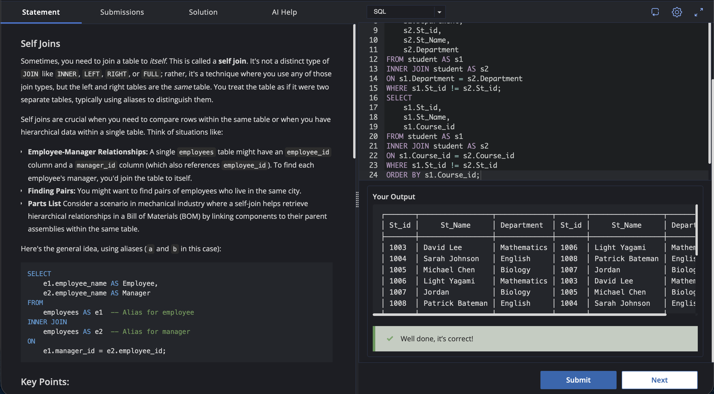

# Experiment 4.6

Name: Pahulpreet Singh

UID: 24BCS10261

## Aim

To practice `SELF JOIN` operations by joining the `student` table with itself to find students belonging to the same department and students who have selected the same `Course_id` as their favorite course.

## Question

### Self Joins

Sometimes, you need to join a table to itself. This is called a self join. It is not a distinct type of `JOIN` like `INNER`, `LEFT`, `RIGHT`, or `FULL`; rather, it is a technique where you use any of those join types, but the left and right tables are the same table. You treat the table as if it were two separate tables, typically using aliases to distinguish them.

Self joins are crucial when you need to compare rows within the same table or when you have hierarchical data within a single table.

Examples of self joins include:

* **Employee-Manager Relationships:** A single `employees` table might have an `employee_id` column and a `manager_id` column, where `manager_id` references another employee in the same table.
* **Finding Pairs:** A self join can be used to find pairs of employees who live in the same city.
* **Parts List:** In a mechanical industry, a self join can retrieve hierarchical relationships in a Bill of Materials (BOM) by linking components to their parent assemblies within the same table.

The general idea of a self join is:

```sql
SELECT
    e1.employee_name AS Employee,
    e2.employee_name AS Manager
FROM
    employees AS e1
INNER JOIN
    employees AS e2
ON
    e1.manager_id = e2.employee_id;
```

### Key Points

* **Table Aliases:** Table aliases such as `a` and `b` (or `e1` and `e2`) are used to differentiate between the two instances of the same table.
* **Join Condition:** The `ON` clause defines how rows within the same table are related. For example, `a.manager_id = b.employee_id` establishes a relationship between an employee and their manager.
* **Join Types:** Although `INNER JOIN` is commonly used with self joins, other join types can also be used.

### Task

We have a `student` table that also stores the `Course_id` of a student's favorite course.
The task has two parts:

1. Find pairs of students that belong to the same department.
2. Identify students who have chosen the same `Course_id` as their favorite. Display the `St_id`, `St_Name`, and `Course_id` and order it in increasing `Course_id`.

## Expected Output

**1. Students Belonging to the Same Department**

| St_id | St_Name         | Department  | St_id | St_Name         | Department  |
|-------|-----------------|-------------|-------|-----------------|-------------|
| 1003  | David Lee       | Mathematics | 1006  | Light Yagami    | Mathematics |
| 1004  | Sarah Johnson   | English     | 1008  | Patrick Bateman | English     |
| 1005  | Michael Chen    | Biology     | 1007  | Jordan          | Biology     |
| 1006  | Light Yagami    | Mathematics | 1003  | David Lee       | Mathematics |
| 1007  | Jordan          | Biology     | 1005  | Michael Chen    | Biology     |
| 1008  | Patrick Bateman | English     | 1004  | Sarah Johnson   | English     |

**2. Students Having the Same Favorite Course** *(Representative Example)*

| St_id | St_Name         | Course_id |
|-------|-----------------|-----------|
| 1004  | Sarah Johnson   | ENG201    |
| 1008  | Patrick Bateman | ENG201    |
| 1003  | David Lee       | MAT202    |
| 1006  | Light Yagami    | MAT202    |

## SQL Queries Used

### 1. Find Students Belonging to the Same Department

```sql
SELECT
    s1.St_id,
    s1.St_Name,
    s1.Department,
    s2.St_id,
    s2.St_Name,
    s2.Department
FROM student AS s1
INNER JOIN student AS s2
ON s1.Department = s2.Department
WHERE s1.St_id <> s2.St_id;
```

### 2. Find Students Having the Same Favorite Course

```sql
SELECT
    s1.St_id,
    s1.St_Name,
    s1.Course_id
FROM student AS s1
INNER JOIN student AS s2
ON s1.Course_id = s2.Course_id
WHERE s1.St_id <> s2.St_id
ORDER BY s1.Course_id;
```

## Output

**1. Students Belonging to the Same Department**

```text
+-------+-----------------+-------------+-------+-----------------+-------------+
| St_id | St_Name         | Department  | St_id | St_Name         | Department  |
+-------+-----------------+-------------+-------+-----------------+-------------+
| 1003  | David Lee       | Mathematics | 1006  | Light Yagami    | Mathematics |
| 1004  | Sarah Johnson   | English     | 1008  | Patrick Bateman | English     |
| 1005  | Michael Chen    | Biology     | 1007  | Jordan          | Biology     |
| 1006  | Light Yagami    | Mathematics | 1003  | David Lee       | Mathematics |
| 1007  | Jordan          | Biology     | 1005  | Michael Chen    | Biology     |
| 1008  | Patrick Bateman | English     | 1004  | Sarah Johnson   | English     |
+-------+-----------------+-------------+-------+-----------------+-------------+
```

## Output Screenshot



## Image Explanation

The screenshot shows the SQL queries executed using a `SELF JOIN` on the `student` table. 

The first query output contains all valid pairs of students who belong to the same department. By using the `WHERE s1.St_id <> s2.St_id` condition, the query successfully filters out instances of students being matched with themselves. The second query similarly outputs and orders the pairings of students who have identical favorite courses.

## Result

The `student` table was successfully joined with itself using the `SELF JOIN` operation. The result accurately displays the hierarchical relationships within the same table, satisfying both tasks by outputting matching departments and matching favorite courses.
