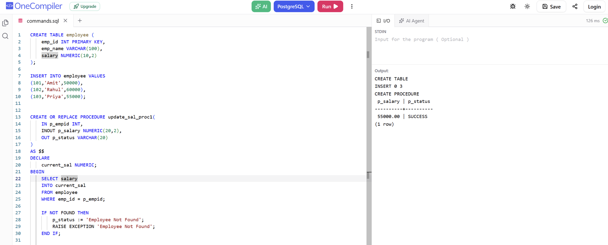

# Experiment 8.1

Name: Pahulpreet Singh

UID: 24BCS10261

## Aim

To create a PostgreSQL procedure that updates an employee's salary using an input salary increment and returns the updated salary and status.

## Question

Create an `employee` table with employee records. Write a PostgreSQL procedure `update_sal_proc1` that accepts employee ID, an increment value, and an output status. If the employee exists, add the increment to the current salary and update the record. Return the updated salary and status.

## SQL Queries Used

```sql
CREATE TABLE employee (
    emp_id INT PRIMARY KEY,
    emp_name VARCHAR(100),
    salary NUMERIC(10,2)
);

INSERT INTO employee VALUES
(101,'Amit',50000),
(102,'Rahul',60000),
(103,'Priya',55000);

CREATE OR REPLACE PROCEDURE update_sal_proc1(
    IN p_empid INT,
    INOUT p_salary NUMERIC(20,2),
    OUT p_status VARCHAR(20)
)
AS $$
DECLARE
    current_sal NUMERIC;
BEGIN
    SELECT salary
    INTO current_sal
    FROM employee
    WHERE emp_id = p_empid;

    IF NOT FOUND THEN
        p_status := 'Employee Not Found';
        RAISE EXCEPTION 'Employee Not Found';
    END IF;

    p_salary := current_sal + p_salary;

    UPDATE employee
    SET salary = p_salary
    WHERE emp_id = p_empid;

    p_status := 'SUCCESS';
END;
$$ LANGUAGE plpgsql;

CALL update_sal_proc1(101, 5000, NULL);
```

## Output

```text
CREATE TABLE
INSERT 0 3
CREATE PROCEDURE

 p_salary | p_status
----------+----------
 55000.00 | SUCCESS
(1 row)
```

## Output Screenshot



## Image Explanation

The screenshot shows the `employee` table and the procedure definition. The procedure uses the employee ID `101` and an increment of `5000`. The existing salary is `50000`, so after addition it becomes `55000.00`, and the status is reported as `SUCCESS`.

## Result

The procedure executed successfully and updated the salary of employee ID 101 to 55000.00 with a status of SUCCESS.
